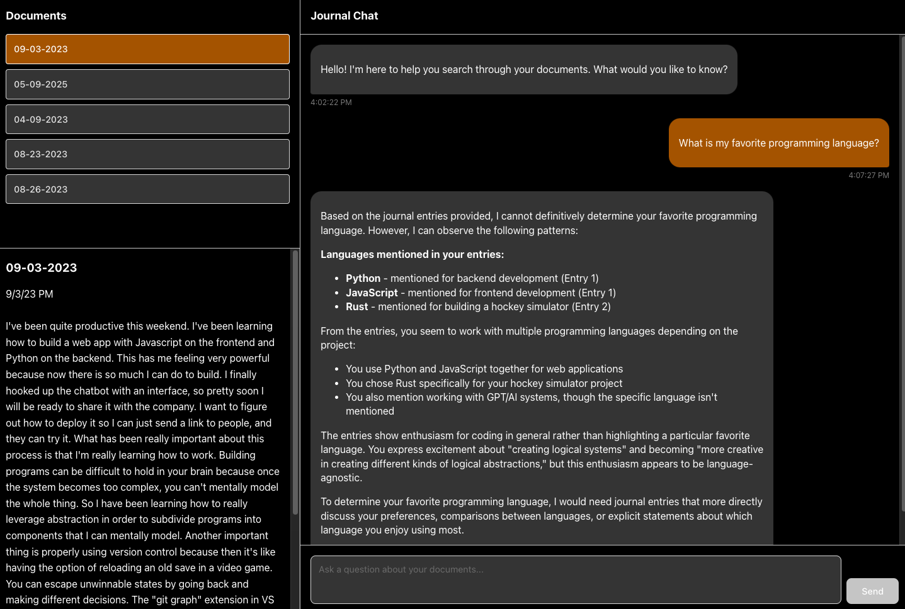

# journal_ocr
This vault contains code for transcribing my journals and interacting with the data. 

</img>

## Environment Setup

### Backend (Python)

Requires Python 3.13+. Uses [uv](https://docs.astral.sh/uv/) for dependency management.

```bash
# Install dependencies
uv sync

# Run the API server (port 8000) - from backend/ directory
cd backend && uv run uvicorn backend.api:app --reload
```

### Frontend (React/Vite)

```bash
cd ui
npm install
npm run dev  # runs on port 5173
```

### Environment Variables

Create a `.env` file in the project root with your API keys:
- `OPENAI_API_KEY` - for embeddings and completions
- `ANTHROPIC_API_KEY` - for Claude completions
- `GOOGLE_API_KEY` - for Gemini completions

### Worktree Setup

If you're working in a git worktree, dependencies won't be shared with the main repo:
1. Run `uv sync` to install Python dependencies locally
2. Run `npm install` in `ui/` to install Node dependencies locally
3. Create your `.env` file with API keys

## Quick Start

1. `./launch.sh` - runs transcription and embedding pipelines, starts docker network, and loads data.
2. `cd ui && npm run dev` - starts frontend.
3. `cd backend && uv run uvicorn backend.api:app --reload` - starts backend API. 

## Current Capabilities
- Checks configured data folder for the journal and makes sure everything is transcribed and embedded, then loads it to elasticsearch. 
- Classifies query intent and selects the best retrieval mechanism from options such as vector RAG or recent entries. 
- Generates an LLM response based on the retrieved entries. 
- Shows LLM response along with retrieved entries in frontend.

## Roadmap
- Add tag retrieval based on entry tags. 
- Add specific date retrieval i.e. last month, last year, September 2021...
- Add frontend and backend into docker network.
- Implement chat history. 
    - Start just with per-session chat. Include a button to clear history. 
    - Store chats in elasticsearch so they can be loaded or searched later. 
- Improve data loading speed via concurrency and batching
