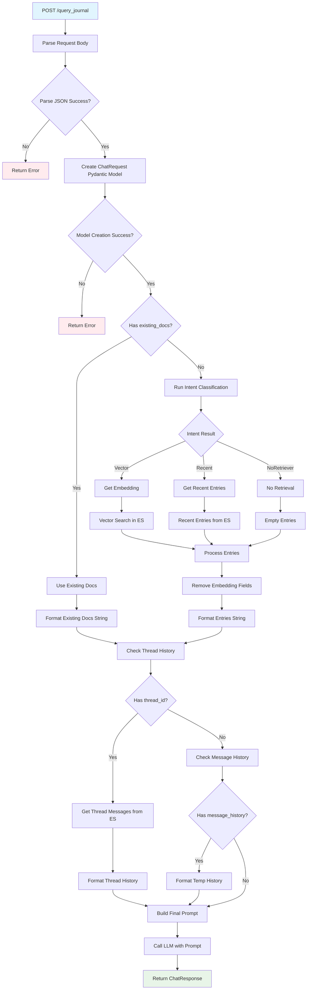

# Query Journal Endpoint Flow

```mermaid
flowchart TD
    A[POST /query_journal] --> B[Parse Request Body]
    B --> C{Parse JSON Success?}
    C -->|No| D[Return Error]
    C -->|Yes| E[Create ChatRequest Pydantic Model]
    E --> F{Model Creation Success?}
    F -->|No| G[Return Error]
    F -->|Yes| H{Has existing_docs?}
    
    H -->|Yes| I[Use Existing Docs]
    H -->|No| J[Run Intent Classification]
    
    J --> K{Intent Result}
    K -->|Vector| L[Get Embedding]
    K -->|Recent| M[Get Recent Entries]
    K -->|NoRetriever| N[No Retrieval]
    
    L --> O[Vector Search in ES]
    M --> P[Recent Entries from ES]
    N --> Q[Empty Entries]
    
    O --> R[Process Entries]
    P --> R
    Q --> R
    
    R --> S[Remove Embedding Fields]
    S --> T[Format Entries String]
    
    I --> U[Format Existing Docs String]
    T --> V[Check Thread History]
    U --> V
    
    V --> W{Has thread_id?}
    W -->|Yes| X[Get Thread Messages from ES]
    W -->|No| Y[Check Message History]
    
    X --> Z[Format Thread History]
    Y --> AA{Has message_history?}
    AA -->|Yes| BB[Format Temp History]
    AA -->|No| CC[Build Final Prompt]
    
    Z --> CC
    BB --> CC
    
    CC --> DD[Call LLM with Prompt]
    DD --> EE[Return ChatResponse]
    
    style A fill:#e1f5fe
    style D fill:#ffebee
    style G fill:#ffebee
    style EE fill:#e8f5e8
```
